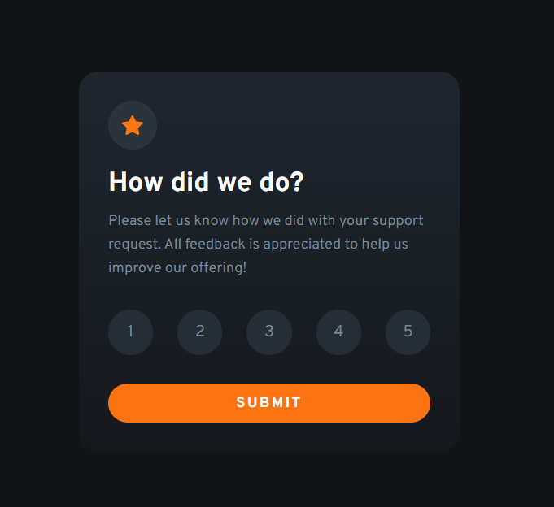
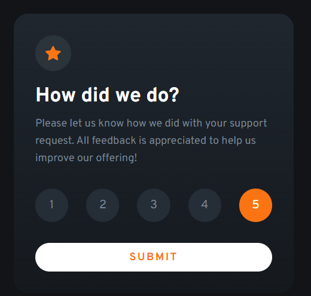

# Frontend Mentor - Interactive rating component solution

This is a solution to the [Interactive rating component challenge on Frontend Mentor](https://www.frontendmentor.io/challenges/interactive-rating-component-koxpeBUmI). Frontend Mentor challenges help you improve your coding skills by building realistic projects. 

## Table of contents

- [The challenge](#the-challenge)
- [Screenshot](#screenshot)
- [Links](#links)
- [My process](#my-process)
- [Built with](#built-with)
- [What I learned](#what-i-learned)
- [Author](#author)

## Overview

### The challenge

Users should be able to:

- View the optimal layout for the app depending on their device's screen size
- See hover states for all interactive elements on the page
- Select and submit a number rating
- See the "Thank you" card state after submitting a rating

### Screenshot





### Links

- Solution URL: [GitHub](https://github.com/71quatro/interactive-Rating-Card)
- Live Site URL: [Add live site URL here](https://your-live-site-url.com)

## My process

- lay out all of the HTML that was going to be needed
- style with CSS 
- have the rating and thank you components disappear and appear with js

### Built with

- Semantic HTML5 markup
- CSS Flex & Grid
- javascript variables & functions 

### What I learned

While working on this project I had a minor setback on how I will go about displaying the thank you componment without having to go to a new page. The apporch that I took was to implement a little bit of javascript. I saved the value of the rating the user gave into a variable and once the submit button was clicked, I hid the rating component and showed the thank you component in it's place. This js function was what made it possible. 

```js
function submit(){
        rating.style.display = 'none';
        thank.style.display = 'block';
        rtext.innerHTML = "You selected " + v + " out of 5"
      }
```

## Author

- Github - [71quatro](https://github.com/71quatro)
- Frontend Mentor - [@arya40](https://www.frontendmentor.io/profile/arya40)
